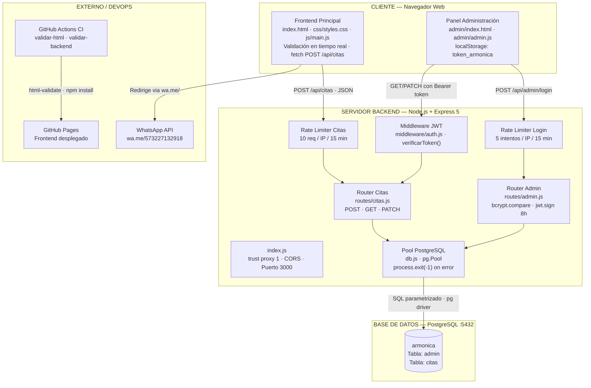

# Diagrama de Arquitectura del Sistema
## ARMÓNICA — Centro de Cosmetología
### Proyecto Productivo SENA · Ficha 2758351

---

## 1. Descripción General de la Arquitectura

El sistema ARMÓNICA sigue una **arquitectura cliente-servidor de tres capas** con componentes desacoplados que se comunican mediante peticiones HTTP/JSON. El frontend estático y el panel de administración residen en el navegador del cliente; el backend RESTful gestiona la lógica de negocio, autenticación y acceso a datos; PostgreSQL persiste la información.

| Componente | Tecnología | Responsabilidad |
|---|---|---|
| **Frontend público** | HTML5, CSS3, JS, Bootstrap 5.3.2 | Presentación de contenido, formulario de citas con validación en tiempo real |
| **Panel de administración** | HTML5, JS vanilla, Bootstrap 5.3.2 | Autenticación JWT, gestión y cambio de estado de citas |
| **Backend API** | Node.js 20 + Express 5 | Lógica de negocio, validación, sanitización XSS, autenticación JWT, rate limiting |
| **Base de datos** | PostgreSQL 14+ | Persistencia de citas y credenciales de administrador |
| **Servicio externo** | WhatsApp API (wa.me) | Canal de comunicación con el cliente |
| **CI/CD** | GitHub Actions + GitHub Pages | Validación automática y despliegue del frontend |

---

## 2. Diagrama de Arquitectura (Mermaid)



---

## 3. Diagrama de Arquitectura (representación ASCII)

```
┌──────────────────────────────────────────────────────────────────────────────────┐
│                            CLIENTE — Navegador Web                                │
│                                                                                   │
│  ┌───────────────────────────────────────┐  ┌────────────────────────────────┐   │
│  │        FRONTEND PRINCIPAL              │  │     PANEL ADMINISTRACIÓN        │   │
│  │                                       │  │                                │   │
│  │  index.html                           │  │  admin/index.html              │   │
│  │  css/styles.css (Bootstrap 5.3.2)     │  │  admin/admin.js                │   │
│  │  js/main.js                           │  │                                │   │
│  │                                       │  │  • Pantalla de login           │   │
│  │  • Secciones: servicios, productos,   │  │    - Validación campos vacíos  │   │
│  │    profesionales, instalaciones,      │  │    - Mensajes de error por     │   │
│  │    resultados, reseñas, formulario    │  │      campo                     │   │
│  │  • Validación en tiempo real          │  │  • Panel de citas (con JWT)    │   │
│  │    (eventos input / change)           │  │    - 3 tarjetas estadísticas   │   │
│  │  • Mensajes de error por campo (#err) │  │    - Tabla con 7 columnas      │   │
│  │  • fetch POST /api/citas con JSON     │  │    - Dropdown cambio de estado │   │
│  │  • Mensaje éxito 5 s · btn "Enviando" │  │  • localStorage: token_armonica│   │
│  │  • Botón WhatsApp flotante            │  │  • Bearer token en cada petición│  │
│  └───────────────────────────────────────┘  └────────────────────────────────┘   │
│             │  HTTP POST /api/citas                  │  Bearer JWT               │
│             │  Content-Type: application/json        │  GET/PATCH /api/citas     │
│             │                                        │  POST /api/admin/login    │
└─────────────┼────────────────────────────────────────┼───────────────────────────┘
              │                                         │
              ▼                                         ▼
┌─────────────────────────────────────────────────────────────────────────────────┐
│                   SERVIDOR BACKEND — Node.js 20 + Express 5                      │
│                                                                                  │
│  backend/index.js                                                               │
│  ├── app.set('trust proxy', 1)   ← IP real del cliente en producción            │
│  ├── cors()                      ← Permite peticiones del frontend              │
│  ├── express.json()              ← Parseo de body JSON                          │
│  ├── /api/citas  → routes/citas.js                                              │
│  └── /api/admin  → routes/admin.js                                              │
│                                                                                  │
│  ┌──────────────────────────────────────┐   ┌────────────────────────────────┐  │
│  │   backend/routes/citas.js             │   │  backend/routes/admin.js       │  │
│  │                                      │   │                                │  │
│  │  ┌─────────────────────────────┐     │   │  Rate Limiter: 5 / 15 min      │  │
│  │  │ Rate Limiter: 10 / 15 min   │     │   │                                │  │
│  │  └─────────────────────────────┘     │   │  POST /api/admin/login          │  │
│  │                                      │   │  ├── Valida usuario + password  │  │
│  │  POST /api/citas                     │   │  ├── SELECT admin WHERE usuario │  │
│  │  ├── Verifica Content-Length ≤ 1 000 │   │  ├── bcrypt.compare()          │  │
│  │  ├── Rechaza campos extra            │   │  └── jwt.sign({ id, usuario },  │  │
│  │  ├── Valida 5 campos (regex)         │   │      JWT_SECRET, { 8h })        │  │
│  │  ├── Sanitiza XSS (<>"'`;)           │   └────────────────────────────────┘  │
│  │  └── INSERT INTO citas               │                                        │
│  │                                      │   ┌────────────────────────────────┐  │
│  │  GET /api/citas ──► [verificarToken] │   │  backend/middleware/auth.js     │  │
│  │  └── SELECT * ORDER BY fecha DESC    │   │                                │  │
│  │                                      │   │  verificarToken(req, res, next) │  │
│  │  PATCH /api/citas/:id ─[verif.Token] │   │  ├── Lee Authorization: Bearer  │  │
│  │  ├── Valida estado (3 opciones)      │   │  ├── jwt.verify(token, SECRET)  │  │
│  │  └── UPDATE citas SET estado         │   │  ├── 401 si ausente/inválido    │  │
│  └──────────────────────────────────────┘   │  └── req.admin = payload       │  │
│                                              └────────────────────────────────┘  │
│  backend/db.js                                                                   │
│  └── const pool = new Pool({ host, port, database, user, password })            │
│      ├── pool.on('connect', ...)  → log de conexión exitosa                     │
│      └── pool.on('error', ...)    → process.exit(-1) ante error irrecuperable   │
└─────────────────────────────────────────────────────────────────────────────────┘
              │
              │ SQL parametrizado ($1, $2...) — pg driver
              ▼
┌─────────────────────────────────────┐
│  BASE DE DATOS — PostgreSQL :5432   │
│                                     │
│  Base: armonica                     │
│                                     │
│  Tabla: admin                       │
│  ├── id           SERIAL PK         │
│  ├── usuario      VARCHAR(50) UNIQUE│
│  ├── password     VARCHAR(255)      │
│  │   (hash bcrypt)                  │
│  └── created_at   TIMESTAMP         │
│                                     │
│  Tabla: citas                       │
│  ├── id             SERIAL PK       │
│  ├── nombre         VARCHAR(100)    │
│  ├── apellido       VARCHAR(100)    │
│  ├── correo         VARCHAR(150)    │
│  ├── telefono       VARCHAR(20)     │
│  ├── procedimiento  VARCHAR(150)    │
│  ├── fecha_solicitud TIMESTAMP      │
│  └── estado         VARCHAR(20)     │
│      DEFAULT 'pendiente'            │
└─────────────────────────────────────┘

┌───────────────────────────────────────────────────────────────────┐
│                    DEVOPS — GitHub Actions CI                      │
│                                                                   │
│  Trigger: push a main / PR a main                                 │
│  Job 1: validar-html   → html-validate index.html                 │
│  Job 2: validar-backend → cd backend && npm install               │
│                          → test -f index.js && test -f package.json│
│  Despliegue:  GitHub Pages (frontend estático automático)         │
│  Pendiente:   Railway (backend) · Playwright integrado en CI      │
└───────────────────────────────────────────────────────────────────┘
```

---

## 4. Flujos de Interacción

### Flujo 1 — Registro de cita vía API REST

```
Clienta         Frontend (js/main.js)    Rate Limiter    Backend API     PostgreSQL
   │                    │                     │               │               │
   │── Escribe datos ──►│                     │               │               │
   │                    │── valida en        │               │               │
   │◄── error campo ────│   tiempo real       │               │               │
   │                    │                     │               │               │
   │── Clic "Agendar" ─►│                     │               │               │
   │                    │── POST /api/citas ──►│               │               │
   │                    │   JSON body         │               │               │
   │                    │                     │── max 10/15min►│               │
   │                    │◄── 429 Too Many ────│  (si excede)  │               │
   │                    │                     │               │               │
   │                    │                     │── pasa ───────►│               │
   │                    │                     │               │── valida──────►│
   │                    │◄──────────────────────── 400 error ─│  (si inválido)│
   │                    │                     │               │               │
   │                    │                     │               │── INSERT ─────►│
   │                    │                     │               │◄── RETURNING ──│
   │                    │◄──────────────────────── 201 + cita─│               │
   │◄── éxito 5 s ──────│                     │               │               │
```

### Flujo 2 — Login del administrador

```
Administradora    Panel Admin (admin.js)    Rate Limiter    Backend API     PostgreSQL
      │                   │                     │                │               │
      │── Ingresa ────────►│                     │                │               │
      │   usuario+pass     │                     │                │               │
      │                    │── POST /admin/login ►│                │               │
      │                    │                     │── max 5/15min ─►│               │
      │                    │◄── 429 demasiados ──│  (si excede)   │               │
      │                    │                     │                │               │
      │                    │                     │── pasa ────────►│               │
      │                    │                     │                │── SELECT ─────►│
      │                    │                     │                │◄── fila admin ─│
      │                    │                     │                │── bcrypt.compare│
      │                    │◄─────────────────────────── 401 ────│  (si inválido) │
      │◄── "Credenciales ──│                     │                │               │
      │    incorrectas"    │                     │                │               │
      │                    │                     │                │── jwt.sign 8h │
      │                    │◄─────────────────────────── 200 + token              │
      │                    │── localStorage ─────►│                │               │
      │                    │   token_armonica     │                │               │
      │◄── Panel citas ────│                     │                │               │
```

### Flujo 3 — Petición protegida con JWT (GET y PATCH)

```
Administradora    Panel Admin     Middleware JWT    Router Citas    PostgreSQL
      │                │                │                │              │
      │── Acción ──────►│                │                │              │
      │   (ver/cambiar) │                │                │              │
      │                 │── GET/PATCH ───►│                │              │
      │                 │  Auth: Bearer  │                │              │
      │                 │                │── jwt.verify() │              │
      │                 │◄── 401 ────────│  (si inválido/ │              │
      │◄── redirige     │   "Token       │   ausente)     │              │
      │    al login     │    inválido"   │                │              │
      │                 │                │── next() ──────►│              │
      │                 │                │   req.admin=    │              │
      │                 │                │   payload       │── SQL ──────►│
      │                 │                │                │◄── datos ────│
      │                 │◄───────────────────────── 200 + datos           │
      │◄── UI actualizada│               │                │              │
```

### Flujo 4 — Cambio de estado de cita

```
Administradora    Panel Admin (cambiarEstado)    Backend API    PostgreSQL
      │                    │                         │               │
      │── Selecciona ──────►│                         │               │
      │   "Confirmada"      │                         │               │
      │                     │── PATCH /api/citas/:id ─►│               │
      │                     │   {estado: "confirmada"} │               │
      │                     │   Authorization: Bearer  │               │
      │                     │                         │── UPDATE ─────►│
      │                     │                         │   SET estado   │
      │                     │                         │◄── RETURNING * ─│
      │                     │◄────────────── 200 + cita│               │
      │                     │── cargarCitas() ────────►│               │
      │◄── tabla refrescada ─│                         │               │
```

### Flujo 5 — Agendamiento vía WhatsApp

```
Clienta          Frontend (js/main.js)    WhatsApp
   │                    │                    │
   │── Completa form ──►│                    │
   │                    │                    │
   │── Clic WhatsApp ──►│                    │
   │                    │── abrirWhatsApp()  │
   │                    │── Construye URL ───►│
   │                    │   wa.me/?text=...   │
   │◄────────────────────────────────────────│
   │   WhatsApp abierto con mensaje          │
   │   pre-llenado listo para enviar         │
```

---

## 5. Entorno de Ejecución

### Desarrollo local

| Componente | Configuración |
|---|---|
| Frontend | Archivos estáticos servidos localmente o con Live Server |
| Backend | `npm run dev` (nodemon) · Puerto 3000 |
| Base de datos | PostgreSQL local · Puerto 5432 · Base: `armonica` |
| Variables de entorno | `backend/.env` (excluido del repositorio con `.gitignore`) |

### Producción / Despliegue

| Componente | Plataforma | Estado |
|---|---|---|
| Frontend | GitHub Pages | Desplegado |
| Backend | Railway (pendiente) | En desarrollo local |
| Base de datos | Railway PostgreSQL (pendiente) | En desarrollo local |

### Variables de entorno requeridas (`backend/.env`)

```
PORT=3000
DB_HOST=localhost
DB_PORT=5432
DB_NAME=armonica
DB_USER=postgres
DB_PASSWORD=<contraseña_segura>
JWT_SECRET=<cadena_aleatoria_mínimo_32_caracteres>
```

> **Nota de seguridad:** El valor de `JWT_SECRET` en producción debe ser distinto al de desarrollo y generarse con un generador criptográfico seguro (p. ej., `node -e "console.log(require('crypto').randomBytes(64).toString('hex'))"`).

---

## 6. Decisiones de Diseño

| Decisión | Justificación |
|---|---|
| Frontend estático sin framework | Reduce la complejidad de build para un proyecto académico; compatibilidad universal y sin dependencias de compilación |
| Bootstrap 5.3.2 | Proporciona responsividad y componentes UI sin CSS adicional significativo; familiaridad del equipo |
| Express 5 | Mayor documentación y comunidad; curva de aprendizaje adecuada para proyecto SENA |
| `pg.Pool` en lugar de `pg.Client` | Reutiliza conexiones entre peticiones concurrentes; más eficiente y resistente a picos de tráfico |
| Variables de entorno para credenciales y JWT_SECRET | Buena práctica de seguridad; evita exponer datos sensibles en el repositorio público |
| `app.set('trust proxy', 1)` | Necesario para que `express-rate-limit` obtenga la IP real del cliente cuando el backend opera detrás de un proxy inverso (Railway, Nginx) |
| JWT con expiración de 8 horas | Balance entre seguridad (sesión limitada) y usabilidad (no requiere reautenticación en una jornada laboral normal) |
| bcrypt para contraseñas | Función de hash con salt y factor de costo configurable; resistente a ataques de diccionario y tablas arcoíris |
| Rate limiting en dos niveles | Protege el endpoint de citas contra spam y el login contra fuerza bruta, con umbrales distintos según el riesgo de cada ruta |
| localStorage para token JWT | Simpleza de implementación en SPA vanilla; adecuado para el alcance del proyecto. En producción con mayor sensibilidad se evaluaría `httpOnly cookie` |
| Mensaje genérico en login fallido | Previene enumeración de usuarios (user enumeration attack): el atacante no puede saber si el usuario existe o si solo la contraseña es incorrecta |
| Sanitización XSS + SQL parametrizado | Doble capa de protección: la sanitización elimina caracteres peligrosos antes de la query; los parámetros evitan inyección SQL independientemente del contenido |
| GitHub Actions para CI | Integrado directamente con el repositorio; gratuito para proyectos públicos; despliegue automático en GitHub Pages |
