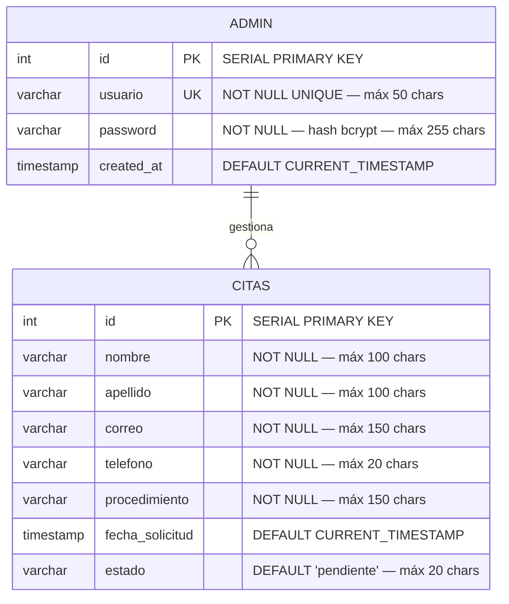

# Diagrama Entidad-Relación de la Base de Datos
## ARMÓNICA — Centro de Cosmetología
### Proyecto Productivo SENA · Ficha 2758351

---

## 1. Descripción General

La base de datos del sistema ARMÓNICA se denomina `armonica` y está implementada en **PostgreSQL**. Contiene dos tablas: `admin` para las credenciales de la administradora del sistema y `citas` para el registro de solicitudes de los clientes.

La relación entre las tablas es **lógica** (no existe llave foránea física): la administradora autenticada gestiona las citas a través del panel de administración, actualizando el campo `estado` mediante el endpoint `PATCH /api/citas/:id`. Toda la lógica relacional se implementa en la capa de aplicación.

---

## 2. Diagrama Entidad-Relación (Mermaid)



---

## 3. Diagrama Entidad-Relación (ASCII)

```
┌────────────────────────────────────────────┐
│                   ADMIN                    │
├─────────────────┬──────────────────────────┤
│ PK  id          │ SERIAL                   │
│ UK  usuario     │ VARCHAR(50) NOT NULL      │
│     password    │ VARCHAR(255) NOT NULL     │
│                 │ (hash bcrypt — ~60 chars) │
│     created_at  │ TIMESTAMP DEFAULT NOW()   │
└────────────────────────────────────────────┘
                         │
                         │ gestiona (relación lógica — sin FK física)
                         │ Panel admin → GET /api/citas (JWT requerido)
                         │ Panel admin → PATCH /api/citas/:id (JWT requerido)
                         │
┌────────────────────────────────────────────┐
│                   CITAS                    │
├─────────────────┬──────────────────────────┤
│ PK  id          │ SERIAL                   │
│     nombre      │ VARCHAR(100) NOT NULL     │
│     apellido    │ VARCHAR(100) NOT NULL     │
│     correo      │ VARCHAR(150) NOT NULL     │
│     telefono    │ VARCHAR(20) NOT NULL      │
│     procedimiento│ VARCHAR(150) NOT NULL    │
│     fecha_solicitud│ TIMESTAMP DEFAULT NOW()│
│     estado      │ VARCHAR(20)               │
│                 │ DEFAULT 'pendiente'        │
└────────────────────────────────────────────┘
```

---

## 4. Descripción Detallada de las Entidades

### 4.1 Entidad: `admin`

Almacena las credenciales de la administradora del sistema. El acceso al panel de gestión requiere autenticación contra esta tabla.

| Atributo | Tipo | Restricciones | Descripción |
|---|---|---|---|
| `id` | `SERIAL` | `PRIMARY KEY` | Identificador único autogenerado de la administradora |
| `usuario` | `VARCHAR(50)` | `NOT NULL`, `UNIQUE` | Nombre de usuario para inicio de sesión; no puede repetirse en el sistema |
| `password` | `VARCHAR(255)` | `NOT NULL` | Contraseña almacenada exclusivamente como hash bcrypt; nunca en texto plano |
| `created_at` | `TIMESTAMP` | `DEFAULT CURRENT_TIMESTAMP` | Fecha y hora de creación del registro |

**Notas técnicas:**
- El campo `password` tiene longitud 255 para acomodar el hash bcrypt completo (formato `$2b$<costo>$<salt><hash>`, típicamente ~60 caracteres; 255 es la convención estándar de la industria).
- La verificación de credenciales se realiza con `bcrypt.compare(passwordIngresada, hashAlmacenado)` en `backend/routes/admin.js`.
- El login fallido devuelve siempre HTTP 401 con el mensaje genérico `"Credenciales incorrectas"`, sin revelar si el usuario existe, para prevenir enumeración de usuarios.

---

### 4.2 Entidad: `citas`

Almacena cada solicitud de cita que un cliente registra a través del endpoint `POST /api/citas`. El campo `estado` refleja el ciclo de vida de la cita gestionado por la administradora.

| Atributo | Tipo | Restricciones | Descripción |
|---|---|---|---|
| `id` | `SERIAL` | `PRIMARY KEY` | Identificador único autogenerado de la cita |
| `nombre` | `VARCHAR(100)` | `NOT NULL` | Nombre(s) del cliente, validado y sanitizado antes de persistir |
| `apellido` | `VARCHAR(100)` | `NOT NULL` | Apellido(s) del cliente, validado y sanitizado antes de persistir |
| `correo` | `VARCHAR(150)` | `NOT NULL` | Correo electrónico del cliente; verificado con regex y contra lista de dominios temporales |
| `telefono` | `VARCHAR(20)` | `NOT NULL` | Número de teléfono o celular (VARCHAR para compatibilidad con formatos con indicativos) |
| `procedimiento` | `VARCHAR(150)` | `NOT NULL` | Tratamiento de interés; debe pertenecer a la lista de 10 opciones válidas |
| `fecha_solicitud` | `TIMESTAMP` | `DEFAULT CURRENT_TIMESTAMP` | Fecha y hora exacta en que se registró la solicitud vía API |
| `estado` | `VARCHAR(20)` | `DEFAULT 'pendiente'` | Ciclo de vida de la cita; valores válidos: `pendiente`, `confirmada`, `cancelada` |

**Notas técnicas:**
- El campo `telefono` es `VARCHAR` (no `INTEGER` ni `BIGINT`) para soportar formatos con indicativos internacionales y evitar truncamiento de ceros iniciales.
- El campo `estado` con valor por defecto `'pendiente'` implementa el flujo de gestión: toda cita comienza pendiente y la administradora la confirma o cancela desde el panel.
- Los campos `nombre` y `apellido` son sanitizados por la función `sanitizar()` en `backend/routes/citas.js` antes de ser persistidos, eliminando los caracteres `< > " ' \` ;`.
- La consulta `GET /api/citas` ordena los resultados por `fecha_solicitud DESC`, garantizando que las citas más recientes aparezcan primero en el panel.

---

## 5. Script DDL de la Base de Datos

El siguiente script crea la base de datos y sus tablas. Corresponde al archivo `database/database.sql` del repositorio.

```sql
-- ================================
-- BASE DE DATOS ARMÓNICA
-- Centro de Cosmetología
-- ================================

-- Tabla de administrador
CREATE TABLE IF NOT EXISTS admin (
  id           SERIAL PRIMARY KEY,
  usuario      VARCHAR(50)  NOT NULL UNIQUE,
  password     VARCHAR(255) NOT NULL,
  created_at   TIMESTAMP    DEFAULT CURRENT_TIMESTAMP
);

-- Tabla de citas
CREATE TABLE IF NOT EXISTS citas (
  id               SERIAL PRIMARY KEY,
  nombre           VARCHAR(100) NOT NULL,
  apellido         VARCHAR(100) NOT NULL,
  correo           VARCHAR(150) NOT NULL,
  telefono         VARCHAR(20)  NOT NULL,
  procedimiento    VARCHAR(150) NOT NULL,
  fecha_solicitud  TIMESTAMP    DEFAULT CURRENT_TIMESTAMP,
  estado           VARCHAR(20)  DEFAULT 'pendiente'
);
```

---

## 6. Relaciones entre Entidades

| Relación | Tipo | Descripción |
|---|---|---|
| `admin` gestiona `citas` | Lógica (sin FK física) | Una administradora autenticada consulta el listado de citas via `GET /api/citas` y actualiza el estado de cada cita via `PATCH /api/citas/:id`. La relación existe en la capa de aplicación, controlada por el middleware JWT. |

**Ciclo de vida del estado de una cita:**

```
           POST /api/citas
                │
                ▼
          ┌──────────┐
          │ pendiente │  ← estado inicial al crear la cita
          └──────────┘
          PATCH /:id   PATCH /:id
              │              │
              ▼              ▼
      ┌────────────┐  ┌───────────┐
      │ confirmada │  │ cancelada │
      └────────────┘  └───────────┘
```

---

## 7. Consultas SQL Implementadas

### 7.1 Insertar una cita

```sql
INSERT INTO citas (nombre, apellido, correo, telefono, procedimiento)
VALUES ($1, $2, $3, $4, $5)
RETURNING *;
```

Origen: `backend/routes/citas.js` — handler `POST /api/citas`

Los parámetros `$1` (nombre) y `$2` (apellido) reciben los valores ya sanitizados por `sanitizar()`. El parámetro `$3` (correo) recibe el valor con `trim()`. El parámetro `$5` (procedimiento) recibe el valor tal como viene del listado validado.

---

### 7.2 Consultar todas las citas

```sql
SELECT * FROM citas
ORDER BY fecha_solicitud DESC;
```

Origen: `backend/routes/citas.js` — handler `GET /api/citas`

Ruta protegida con middleware JWT (`verificarToken`). Solo accesible con un token válido generado por `POST /api/admin/login`.

---

### 7.3 Actualizar el estado de una cita

```sql
UPDATE citas
SET estado = $1
WHERE id = $2
RETURNING *;
```

Origen: `backend/routes/citas.js` — handler `PATCH /api/citas/:id`

El parámetro `$1` (estado) solo puede contener uno de los tres valores válidos: `'pendiente'`, `'confirmada'`, `'cancelada'`, validados en el handler antes de ejecutar la query. El parámetro `$2` (id) proviene de `req.params.id`. Si `RETURNING *` devuelve cero filas, el handler responde HTTP 404 indicando que la cita no existe. Ruta protegida con middleware JWT.

---

## 8. Consideraciones de Seguridad de la Base de Datos

| Aspecto | Estado | Detalle |
|---|---|---|
| Credenciales de conexión | Implementado | Variables de entorno en `.env` excluido del repositorio via `.gitignore`. Variables: `DB_HOST`, `DB_PORT`, `DB_NAME`, `DB_USER`, `DB_PASSWORD`. |
| Hashing de contraseñas | Implementado | `bcrypt` usado en `routes/admin.js` con `bcrypt.compare()`. Las contraseñas nunca se almacenan ni transmiten en texto plano. |
| Inyección SQL | Implementado | Todas las queries usan consultas parametrizadas (`$1, $2...`) con el driver `pg`. Ninguna query concatena strings de usuario directamente. |
| Sanitización XSS | Implementado | La función `sanitizar()` en `routes/citas.js` elimina `< > " ' \` ;` de los campos de texto libre antes de pasarlos a la query. |
| Validación de entrada | Implementado | Validación exhaustiva de todos los campos en el backend antes de cualquier acceso a la base de datos. Campos extra rechazados. Tamaño del body limitado. |
| Conexión pooling | Implementado | `pg.Pool` en `db.js` reutiliza conexiones eficientemente. Error en el pool llama `process.exit(-1)` para reinicio controlado. |
| Acceso a datos protegido | Implementado | Los endpoints `GET /api/citas` y `PATCH /api/citas/:id` requieren token JWT válido. El token se verifica en cada petición en `middleware/auth.js`. |
| Secreto JWT | Implementado | `JWT_SECRET` se lee desde variables de entorno. Nunca está hardcodeado en el código fuente. |
